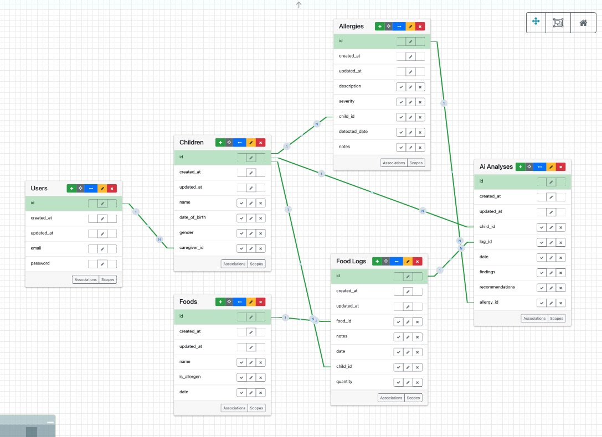
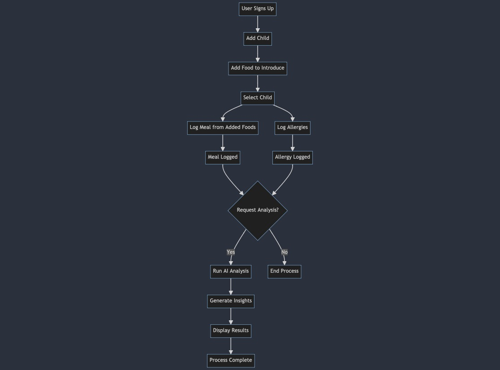
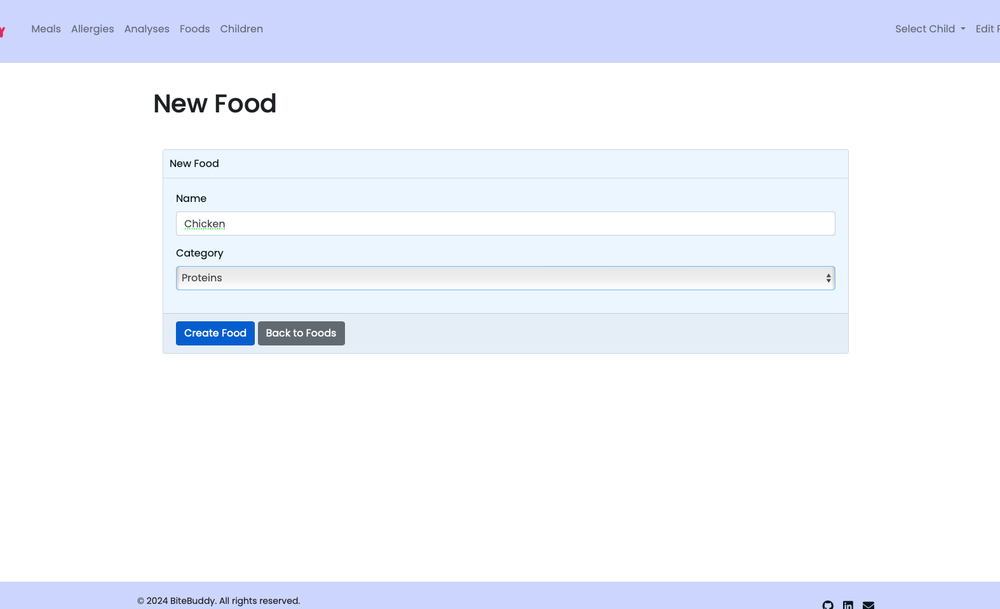
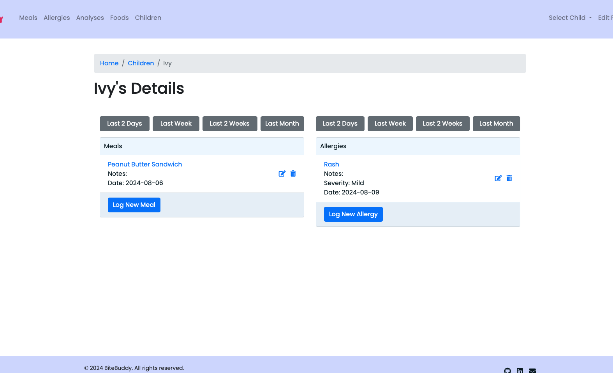
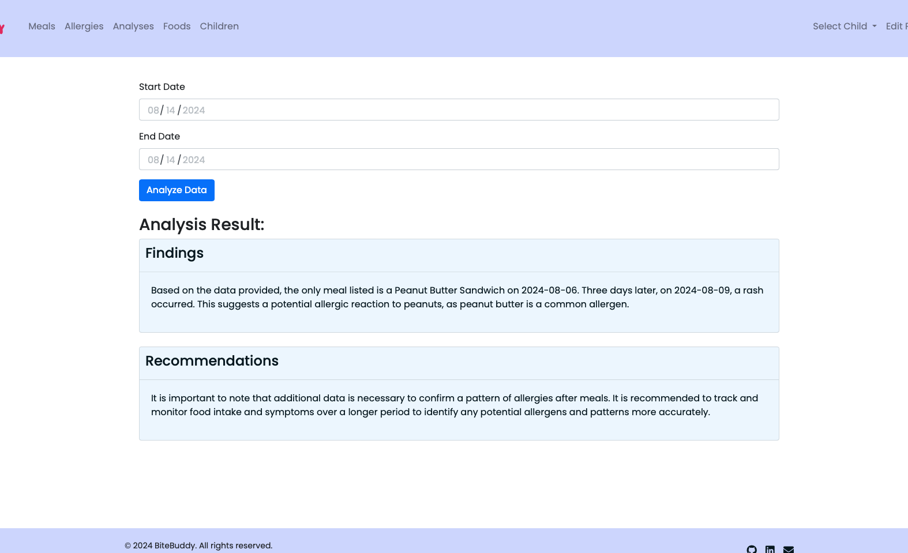

## BiteBuddy Functional Specifications

- **BiteBuddy**: A platform designed to help caregivers log their child's meals and allergic reactions, providing tools to monitor and identify potential food allergies. The platform leverages AI to analyze data, ensuring informed decision-making for the safety and well-being of infants and toddlers.
- **Ensuring safe meals, one bite at a time.**

## Pain Points
- Monitoring and identifying a child’s food allergies can be complex and time-consuming, with caregivers needing a reliable system to track meals and reactions over time.
- Correlating allergic reactions with specific foods without systematic data logging and analysis can lead to missed patterns, potentially putting a child's health at risk.

## Proposed Solution
- BiteBuddy offers a centralized platform where caregivers can log meals and allergic reactions independently. The platform provides an AI-driven analysis that helps caregivers identify potential correlations between foods and allergic reactions, enabling proactive allergy management.

## Key Features
1. **User Management**: Secure user sign-up, login, and profile management features.
2. **Child Management**: Ability to add, update, and manage multiple children’s profiles within a single user account.
3. **Meal Logging**: Functionality to log meals with details like food type, quantity, and time.
4. **Allergy Logging**: Capability to log allergic reactions with details such as symptoms, severity, and time of occurrence.
5. **Food Management**: Users can add, update, and categorize new foods they plan to introduce to their child.
6. **AI Analysis**: Optional AI-driven analysis that correlates logged meals and allergic reactions to identify potential food allergens.
7. **Security**: Implementation of secure data storage, ensuring that all user data, including meal logs and allergic reactions, is protected.

## User Stories
### MVP
- As a user, I want to create and manage a profile for each of my children, so that I can track their individual dietary habits and allergies.
- As a user, I want to log the food my child consumes, so that I can track their diet and identify any food-related issues.
- As a user, I want to log any allergic reactions my child has, so that I can monitor and manage my child's allergies effectively.
- As a user, I want to add new food items to the list, so that I can accurately log all foods my child consumes.
- As a user, I want to view all logged food entries, so that I can monitor my child's diet over time.
- As a user, I want to view all logged allergy reactions, so that I can monitor my child's allergies over time.
- As a user, I want the app to analyze food and allergy logs using AI, so that I can identify potential correlations between foods and allergic reactions.
- As a user, I want to view the results of the AI analysis, so that I can take informed actions to manage my child's allergies.

### Future Enhancements
- As a user, I want to receive alerts or notifications when a potential allergen is detected based on logged meals and reactions, so that I can take immediate action.
- As a user, I want to share my child’s allergy history with healthcare providers, so that I can provide accurate information during consultations.
- As a user, I want the option to export the logged data and analysis reports, so that I can keep a backup or share it with others.

## Domain Model
### users
```ruby
# - id
# - created_at
# - updated_at
# - email
# - password

class User
    has_many :children
end

# - id
# - created_at
# - updated_at
# - name
# - date_of_birth
# - gender
# - caregiver_id

class Child
    belongs_to :caregiver, class_name: "User"
    has_many :meals
    has_many :allergies
    has_many :analyses
end

# - id
# - created_at
# - updated_at
# - name
# - category

class Food
    has_many :meals
end

# - id
# - created_at
# - updated_at
# - food_id
# - child_id
# - date
# - notes

class Meal
    belongs_to :child
    belongs_to :food
    has_many :analyses
end

# - id
# - created_at
# - updated_at
# - description
# - severity
# - detected_date
# - child_id
# - notes

class Allergy
    belongs_to :child
    has_many :analyses
end

#  id              :integer          
#  date            :date
#  findings        :string
#  recommendations :text
#  created_at      :datetime        
#  updated_at      :datetime        
#  allergy_id      :integer
#  child_id        :integer
#  meal_id         :integer

class Analysis
    belongs_to :child
    belongs_to :meals
    belongs_to :allergies
end
```



## Associations

- **User has_many Children**: Each user can have multiple children profiles under their account.
- **Child belongs_to User**: Each child is associated with a single user (caregiver).
- **Child has_many FoodLogs**: Each child can have multiple meal logs.
- **Child has_many Allergies**: Each child can have multiple allergic reactions recorded.
- **FoodLog belongs_to Child and Food**: Each meal log is associated with one child and one food item.
- **Allergy belongs_to Child**: Each allergic reaction is associated with one child.
- **Analysis belongs_to Child**: Each analysis is associated with one child and uses data from their logged meals and allergies.

## Hypothesis

- **Hypothesis**: By providing caregivers with a platform to systematically log meals and allergic reactions, combined with AI-driven analysis, caregivers will be better equipped to identify potential food allergies in their children, leading to more informed and proactive management of their child's diet and health.
- **Testing**: The hypothesis will be tested by tracking user engagement with the logging features and measuring the accuracy and usefulness of the AI-driven insights. User feedback will also be gathered to evaluate the effectiveness of the platform in helping caregivers manage their child's food allergies.

## Target User Persona

- **Name**: Emily, 32
- **Occupation**: Stay-at-home mom
- **Tech-Savviness**: Moderate

### Pain Points:
- Emily struggles to keep track of the foods her child eats and any allergic reactions.
- She is concerned about missing potential allergens and wants a reliable way to track and analyze her child’s diet.

### Goals:
- Emily wants a simple, intuitive platform to log meals and allergies and to receive insights on potential food allergens.
- She values clear, actionable information that helps her make informed decisions about her child’s diet.


### Flowchart 🗺️

This flowchart provides a detailed overview of the core processes within the BiteBuddy application, visualized using Mermaid.js. 

### Key Stages:
- **User Sign-Up:** The entry point for new users, where they create an account.
- **Child Management:** Users add their child to the system, which is essential for associating meals and allergies.
- **Food Introduction:** Users log the foods they plan to introduce to their child.
- **Meal Logging:** Users can log meals for their child using the foods they've added. This process is independent and can be performed at any time.
- **Allergy Logging:** Users can log any allergic reactions their child experiences, also independent of meal logging.
- **AI Analysis:** If the user requests it, the application runs an AI-driven analysis combining logged meals and allergies to generate insights.
- **Result Display:** The analysis results are displayed to the user but are not stored in the system.



## Test User Access

To explore the functionality of the BiteBuddy app, you can log in using the following test user credentials:

- **Email:** testuser@example.com
- **Password:** password

This test account allows you to experience the app's features, such as logging meals, tracking allergies, and running AI analyses, without needing to create a new account.


## Screenshots

- **Screenshot 1**: Child Profile Setup and Food Introduction workflow.


- **Screenshot 2**: Meal Logging and Allergy Logging interfaces.


- **Screenshot 3**: AI Analysis Results display.

